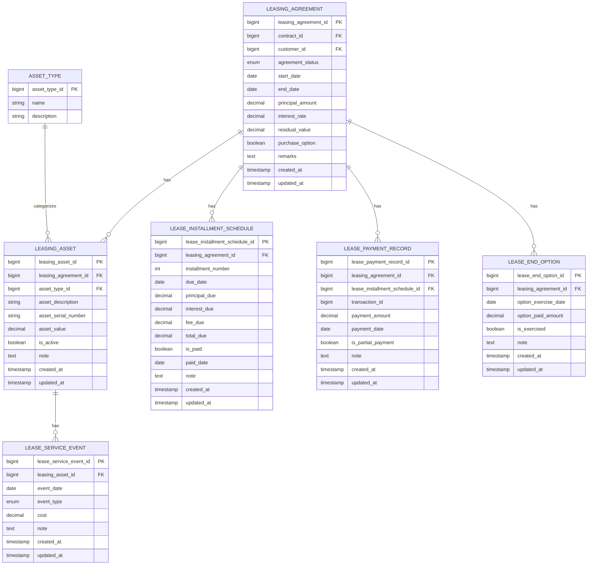

# Core Lending Leasing Service


## Índice
- [Descripción General](#descripción-general)
- [Arquitectura del Sistema](#arquitectura-del-sistema)
  - [Estructura de Módulos](#estructura-de-módulos)
  - [Diagrama ER de la Base de Datos](#diagrama-er-de-la-base-de-datos)
- [Tecnologías Utilizadas](#tecnologías-utilizadas)
- [Requisitos Previos](#requisitos-previos)
- [Instalación y Ejecución](#instalación-y-ejecución)
  - [Variables de Entorno](#variables-de-entorno)
  - [Compilación](#compilación)
  - [Ejecución Local](#ejecución-local)
  - [Ejecución con Docker](#ejecución-con-docker)
- [Pruebas y Endpoints](#pruebas-y-endpoints)
  - [Documentación de la API](#documentación-de-la-api)
  - [Endpoints Principales](#endpoints-principales)
  - [Monitoreo y Health Checks](#monitoreo-y-health-checks)
- [Estructura del Repositorio](#estructura-del-repositorio)
- [Configuración](#configuración)
  - [Perfiles de Aplicación](#perfiles-de-aplicación)
  - [Configuración de Base de Datos](#configuración-de-base-de-datos)
- [Guías de Desarrollo](#guías-de-desarrollo)
- [Despliegue](#despliegue)
  - [Kubernetes](#kubernetes)
  - [CI/CD](#cicd)
- [Licencia](#licencia)

## Descripción General

El Core Lending Leasing Service es un componente microservicio de la plataforma Firefly que gestiona contratos de arrendamiento, activos, registros de pagos, programas de cuotas y otras funcionalidades relacionadas con el leasing. Proporciona una API completa para crear y gestionar acuerdos de arrendamiento y sus datos asociados.

Este servicio forma parte de una arquitectura de microservicios más amplia, diseñada para proporcionar soluciones financieras flexibles y escalables. Utiliza un enfoque reactivo para garantizar un alto rendimiento y una baja latencia, incluso bajo cargas elevadas.

## Arquitectura del Sistema

### Estructura de Módulos

El servicio está construido como un proyecto Maven multi-módulo con los siguientes componentes:

1. **core-lending-leasing-interfaces**: Contiene DTOs (Data Transfer Objects) e interfaces de API
2. **core-lending-leasing-models**: Contiene entidades de base de datos y repositorios
3. **core-lending-leasing-core**: Contiene lógica de negocio e implementaciones de servicios
4. **core-lending-leasing-web**: Contiene controladores REST y configuración de la aplicación
5. **core-lending-leasing-sdk**: Contiene especificaciones OpenAPI y clientes generados

Esta estructura modular permite una clara separación de responsabilidades y facilita el mantenimiento y la evolución del sistema.

### Diagrama ER de la Base de Datos



## Tecnologías Utilizadas

El Core Lending Leasing Service utiliza las siguientes tecnologías:

- **Java 21**: Lenguaje de programación base
- **Spring Boot**: Framework de aplicación que facilita la creación de aplicaciones Spring
- **Spring WebFlux**: Framework web reactivo para construir aplicaciones web no bloqueantes
- **Spring Cloud**: Proporciona herramientas para sistemas distribuidos comunes
- **R2DBC**: Reactive Relational Database Connectivity para acceso reactivo a bases de datos
- **PostgreSQL**: Sistema de gestión de bases de datos relacional
- **Flyway**: Herramienta de migración de bases de datos
- **Maven**: Herramienta de gestión y construcción de proyectos
- **Docker**: Plataforma de contenedores para empaquetar, distribuir y ejecutar aplicaciones
- **Swagger/OpenAPI**: Documentación de API y generación de clientes
- **JUnit 5**: Framework de pruebas unitarias
- **Mockito**: Framework de mocking para pruebas

## Requisitos Previos

Para desarrollar y ejecutar el Core Lending Leasing Service, necesitarás:

- **Java 21** o superior
- **Maven 3.8** o superior
- **Docker** (para despliegue en contenedores)
- **PostgreSQL** (puede ser ejecutado en Docker)
- **Git** para control de versiones

## Instalación y Ejecución

### Variables de Entorno

El servicio requiere las siguientes variables de entorno:

```
DB_HOST=localhost
DB_PORT=5432
DB_NAME=lending_leasing
DB_USERNAME=postgres
DB_PASSWORD=postgres
DB_SSL_MODE=disable
```

### Compilación

Para compilar el proyecto:

```bash
mvn clean package
```

Para omitir las pruebas durante la compilación:

```bash
mvn clean package -DskipTests
```

### Ejecución Local

Para ejecutar la aplicación localmente:

```bash
mvn spring-boot:run -pl core-lending-leasing-web
```

O después de compilar:

```bash
java -jar core-lending-leasing-web/target/core-lending-leasing-web-*.jar
```

### Ejecución con Docker

Para construir y ejecutar la aplicación con Docker:

```bash
# Construir la imagen Docker
docker build -t core-lending-leasing .

# Ejecutar el contenedor
docker run -p 8080:8080 \
  -e DB_HOST=host.docker.internal \
  -e DB_PORT=5432 \
  -e DB_NAME=lending_leasing \
  -e DB_USERNAME=postgres \
  -e DB_PASSWORD=postgres \
  -e DB_SSL_MODE=disable \
  core-lending-leasing
```

También puedes utilizar Docker Compose para ejecutar el servicio junto con una base de datos PostgreSQL:

```yaml
# docker-compose.yml
version: '3.8'
services:
  app:
    build: .
    ports:
      - "8080:8080"
    environment:
      - DB_HOST=postgres
      - DB_PORT=5432
      - DB_NAME=lending_leasing
      - DB_USERNAME=postgres
      - DB_PASSWORD=postgres
      - DB_SSL_MODE=disable
    depends_on:
      - postgres

  postgres:
    image: postgres:14
    ports:
      - "5432:5432"
    environment:
      - POSTGRES_DB=lending_leasing
      - POSTGRES_USER=postgres
      - POSTGRES_PASSWORD=postgres
    volumes:
      - postgres-data:/var/lib/postgresql/data

volumes:
  postgres-data:
```

Ejecutar con Docker Compose:

```bash
docker-compose up -d
```

## Pruebas y Endpoints

### Documentación de la API

La documentación de la API está disponible en:

- **Swagger UI**: `/swagger-ui.html`
- **Especificación OpenAPI**: `/v3/api-docs`

### Endpoints Principales

El servicio proporciona una API RESTful con los siguientes endpoints principales:

#### Acuerdos de Arrendamiento (Leasing Agreements)

```
GET /api/v1/leasing-agreements
POST /api/v1/leasing-agreements
GET /api/v1/leasing-agreements/{id}
PUT /api/v1/leasing-agreements/{id}
DELETE /api/v1/leasing-agreements/{id}
```

Ejemplo de creación de un acuerdo de arrendamiento:

```
POST /api/v1/leasing-agreements

{
  "contractId": 12345,
  "customerId": 67890,
  "agreementStatus": "ACTIVE",
  "startDate": "2023-01-01",
  "endDate": "2025-01-01",
  "principalAmount": 50000.00,
  "interestRate": 5.25,
  "residualValue": 10000.00,
  "purchaseOption": true,
  "remarks": "Contrato de arrendamiento para equipo industrial"
}
```

#### Activos de Arrendamiento (Leasing Assets)

```
GET /api/v1/leasing-assets
POST /api/v1/leasing-assets
GET /api/v1/leasing-assets/{id}
PUT /api/v1/leasing-assets/{id}
DELETE /api/v1/leasing-assets/{id}
```

#### Registros de Pago (Lease Payment Records)

```
GET /api/v1/lease-payment-records
POST /api/v1/lease-payment-records
GET /api/v1/lease-payment-records/{id}
PUT /api/v1/lease-payment-records/{id}
DELETE /api/v1/lease-payment-records/{id}
```

#### Programas de Cuotas (Lease Installment Schedules)

```
GET /api/v1/lease-installment-schedules
POST /api/v1/lease-installment-schedules
GET /api/v1/lease-installment-schedules/{id}
PUT /api/v1/lease-installment-schedules/{id}
DELETE /api/v1/lease-installment-schedules/{id}
```

#### Opciones de Fin de Arrendamiento (Lease End Options)

```
GET /api/v1/lease-end-options
POST /api/v1/lease-end-options
GET /api/v1/lease-end-options/{id}
PUT /api/v1/lease-end-options/{id}
DELETE /api/v1/lease-end-options/{id}
```

#### Eventos de Servicio (Lease Service Events)

```
GET /api/v1/lease-service-events
POST /api/v1/lease-service-events
GET /api/v1/lease-service-events/{id}
PUT /api/v1/lease-service-events/{id}
DELETE /api/v1/lease-service-events/{id}
```

### Monitoreo y Health Checks

La aplicación proporciona los siguientes endpoints para monitoreo:

- `/actuator/health`: Endpoint de verificación de salud
- `/actuator/info`: Información de la aplicación
- `/actuator/prometheus`: Métricas para Prometheus

## Estructura del Repositorio

```
core-lending-leasing/
├── .github/                      # Configuraciones de GitHub (workflows, etc.)
├── core-lending-leasing-core/    # Lógica de negocio
│   └── src/
│       ├── main/
│       │   └── java/
│       └── test/
├── core-lending-leasing-interfaces/ # DTOs e interfaces de API
│   └── src/
│       ├── main/
│       │   └── java/
│       └── test/
├── core-lending-leasing-models/  # Entidades y repositorios
│   └── src/
│       ├── main/
│       │   ├── java/
│       │   └── resources/
│       │       └── db/migration/  # Scripts de migración Flyway
│       └── test/
├── core-lending-leasing-sdk/     # SDK y especificaciones OpenAPI
│   └── src/
│       ├── main/
│       │   └── resources/
│       │       └── api-spec/     # Especificaciones OpenAPI
│       └── test/
├── core-lending-leasing-web/     # Controladores REST y configuración
│   └── src/
│       ├── main/
│       │   ├── java/
│       │   └── resources/
│       └── test/
├── Dockerfile                    # Configuración para Docker
├── pom.xml                       # Configuración de Maven (proyecto padre)
└── README.md                     # Este archivo
```

## Configuración

### Perfiles de Aplicación

La aplicación soporta los siguientes perfiles:

- **dev**: Entorno de desarrollo con logging detallado
- **testing**: Entorno de pruebas
- **prod**: Entorno de producción con logging mínimo y Swagger UI deshabilitado

Para activar un perfil específico:

```bash
java -jar -Dspring.profiles.active=dev core-lending-leasing-web/target/core-lending-leasing-web-*.jar
```

### Configuración de Base de Datos

La aplicación utiliza PostgreSQL con R2DBC para acceso reactivo a la base de datos. Flyway se utiliza para migraciones de base de datos.

Configuración típica en `application.yml`:

```yaml
spring:
  r2dbc:
    url: r2dbc:postgresql://${DB_HOST}:${DB_PORT}/${DB_NAME}
    username: ${DB_USERNAME}
    password: ${DB_PASSWORD}
    properties:
      sslMode: ${DB_SSL_MODE}

  flyway:
    url: jdbc:postgresql://${DB_HOST}:${DB_PORT}/${DB_NAME}
    user: ${DB_USERNAME}
    password: ${DB_PASSWORD}
    locations: classpath:db/migration
```

## Guías de Desarrollo

### Estructura del Proyecto

- Sigue la estructura de paquetes: `com.firefly.core.lending.leasing.[módulo].[componente].[versión]`
- Usa versionado en nombres de paquetes (ej., `v1`) para soportar versionado de API
- Mantén los controladores en el módulo web
- Mantén la lógica de negocio en el módulo core
- Mantén el acceso a datos en el módulo models
- Mantén los DTOs e interfaces en el módulo interfaces

### Estándares de Codificación

- Usa programación reactiva con Reactor (Mono/Flux)
- Sigue las mejores prácticas de Spring Boot
- Usa manejo de errores adecuado con Mono.error()
- Implementa validación adecuada
- Escribe pruebas unitarias para todos los componentes

Ejemplo de servicio reactivo:

```java
@Service
public class LeasingAgreementServiceImpl implements LeasingAgreementService {

    private final LeasingAgreementRepository repository;

    public LeasingAgreementServiceImpl(LeasingAgreementRepository repository) {
        this.repository = repository;
    }

    @Override
    public Mono<LeasingAgreement> findById(Long id) {
        return repository.findById(id)
            .switchIfEmpty(Mono.error(new ResourceNotFoundException("Leasing Agreement not found with id: " + id)));
    }

    @Override
    public Flux<LeasingAgreement> findAll() {
        return repository.findAll();
    }

    @Override
    public Mono<LeasingAgreement> save(LeasingAgreement leasingAgreement) {
        return repository.save(leasingAgreement);
    }

    // Otros métodos...
}
```

## Despliegue

### Kubernetes

La aplicación puede ser desplegada en Kubernetes utilizando el Dockerfile proporcionado. Asegúrate de configurar las variables de entorno requeridas en tu configuración de despliegue de Kubernetes.

Ejemplo de configuración de Kubernetes:

```yaml
apiVersion: apps/v1
kind: Deployment
metadata:
  name: core-lending-leasing
spec:
  replicas: 2
  selector:
    matchLabels:
      app: core-lending-leasing
  template:
    metadata:
      labels:
        app: core-lending-leasing
    spec:
      containers:
      - name: core-lending-leasing
        image: core-lending-leasing:latest
        ports:
        - containerPort: 8080
        env:
        - name: DB_HOST
          value: "postgres-service"
        - name: DB_PORT
          value: "5432"
        - name: DB_NAME
          value: "lending_leasing"
        - name: DB_USERNAME
          valueFrom:
            secretKeyRef:
              name: db-credentials
              key: username
        - name: DB_PASSWORD
          valueFrom:
            secretKeyRef:
              name: db-credentials
              key: password
        - name: DB_SSL_MODE
          value: "disable"
        readinessProbe:
          httpGet:
            path: /actuator/health
            port: 8080
          initialDelaySeconds: 30
          periodSeconds: 10
```

### CI/CD

La aplicación utiliza GitHub Actions para CI/CD. El flujo de trabajo está definido en `.github/workflows/publish.yml`.

El pipeline de CI/CD incluye:
- Compilación y pruebas
- Análisis de código estático
- Construcción de imagen Docker
- Publicación de la imagen en un registro de contenedores
- Despliegue en entornos de desarrollo/staging/producción

## Licencia

Este proyecto está licenciado bajo la Licencia MIT - ver el archivo [LICENSE](LICENSE) para más detalles.

Copyright (c) 2023 Firefly
