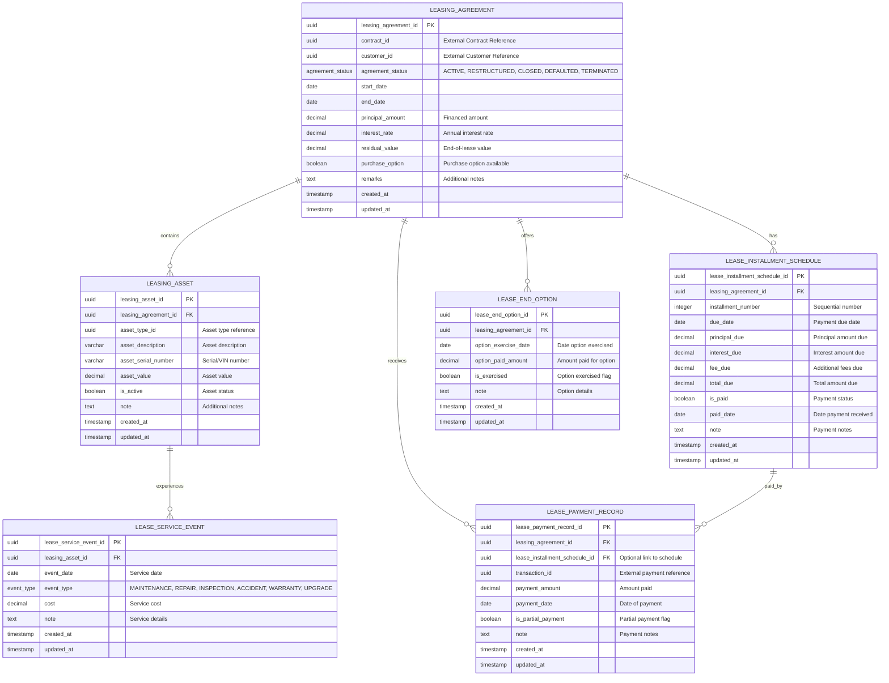

# Core Lending Leasing Service


A comprehensive leasing management microservice built as part of the **Firefly OpenCore Banking Platform** developed by **Firefly Software Solutions Inc** under the Apache 2.0 license.

## Table of Contents
- [Overview](#overview)
- [System Architecture](#system-architecture)
  - [Module Structure](#module-structure)
  - [Database Entity Relationship Diagram](#database-entity-relationship-diagram)
- [Technology Stack](#technology-stack)
- [Prerequisites](#prerequisites)
- [Installation and Execution](#installation-and-execution)
  - [Environment Variables](#environment-variables)
  - [Building the Project](#building-the-project)
  - [Local Execution](#local-execution)
- [API Documentation](#api-documentation)
  - [OpenAPI Specification](#openapi-specification)
  - [Main Endpoints](#main-endpoints)
  - [Health Checks and Monitoring](#health-checks-and-monitoring)
- [Repository Structure](#repository-structure)
- [Configuration](#configuration)
  - [Application Profiles](#application-profiles)
  - [Database Configuration](#database-configuration)
- [Development Guidelines](#development-guidelines)
- [Testing](#testing)
- [Contributing](#contributing)
- [License](#license)

## Overview

The Core Lending Leasing Service is a reactive microservice that provides comprehensive leasing agreement management capabilities within the Firefly OpenCore Banking Platform. This service handles the complete lifecycle of leasing agreements, from creation to closure, including asset management, payment tracking, installment scheduling, and end-of-lease options.

**Key Features:**
- **Leasing Agreement Management**: Create, update, and manage leasing contracts with comprehensive status tracking
- **Asset Management**: Track leased assets with detailed information including type, value, and service history
- **Payment Processing**: Record and track lease payments with support for partial payments and installment linking
- **Installment Scheduling**: Generate and manage payment schedules with principal, interest, and fee calculations
- **Service Event Tracking**: Monitor maintenance, repairs, and other asset-related events
- **End-of-Lease Options**: Handle purchase options and lease termination scenarios
- **Reactive Architecture**: Built with Spring WebFlux for high-performance, non-blocking operations
- **Comprehensive Validation**: Input validation using Jakarta Bean Validation with custom validators

## System Architecture

### Module Structure

The service is built as a Maven multi-module project with clear separation of concerns:

1. **core-lending-leasing-interfaces**: Contains DTOs (Data Transfer Objects), enums, and API interfaces
2. **core-lending-leasing-models**: Contains database entities, repositories, and database migrations
3. **core-lending-leasing-core**: Contains business logic, service implementations, and mappers
4. **core-lending-leasing-web**: Contains REST controllers, configuration, and web layer components
5. **core-lending-leasing-sdk**: Contains OpenAPI specifications and generated client SDKs

This modular architecture ensures:
- **Clear separation of concerns** between layers
- **Easy maintenance** and evolution of individual components
- **Reusable components** across different parts of the application
- **Independent testing** of each module

### Database Entity Relationship Diagram



## Technology Stack

The Core Lending Leasing Service leverages modern technologies for high-performance reactive applications:

### Core Technologies
- **Java 21**: Latest LTS version with modern language features and performance improvements
- **Spring Boot 3.x**: Enterprise-grade application framework with auto-configuration
- **Spring WebFlux**: Reactive web framework for non-blocking, asynchronous operations
- **Spring Data R2DBC**: Reactive database access with non-blocking I/O
- **PostgreSQL**: Robust relational database with excellent JSON and UUID support

### Data & Persistence
- **R2DBC PostgreSQL**: Reactive database driver for PostgreSQL
- **Flyway**: Database migration and versioning tool
- **Spring Data R2DBC**: Reactive repository abstraction

### API & Documentation
- **SpringDoc OpenAPI**: Automatic API documentation generation
- **OpenAPI 3.0**: Industry-standard API specification
- **Swagger UI**: Interactive API documentation interface

### Development & Build Tools
- **Maven**: Project management and build automation
- **Lombok**: Reduces boilerplate code with annotations
- **MapStruct**: Type-safe bean mapping with compile-time code generation

### Monitoring & Observability
- **Spring Boot Actuator**: Production-ready monitoring and management endpoints
- **Micrometer**: Application metrics collection
- **Prometheus**: Metrics collection and monitoring

### Testing
- **JUnit 5**: Modern testing framework with advanced features
- **Reactor Test**: Testing utilities for reactive streams
- **Spring Boot Test**: Comprehensive testing support for Spring applications

## Prerequisites

To develop and run the Core Lending Leasing Service, you need:

- **Java 21** or higher (OpenJDK or Oracle JDK)
- **Maven 3.8** or higher
- **PostgreSQL 14** or higher (can be run via Docker)
- **Git** for version control
- **IDE** with Java 21 support (IntelliJ IDEA, Eclipse, VS Code)

## Installation and Execution

### Environment Variables

The service requires the following environment variables:

```bash
# Database Configuration
DB_HOST=localhost
DB_PORT=5432
DB_NAME=lending_leasing
DB_USERNAME=postgres
DB_PASSWORD=postgres
DB_SSL_MODE=disable

# Application Configuration (Optional)
SPRING_PROFILES_ACTIVE=dev
SERVER_PORT=8080
```

### Building the Project

To build the entire project:

```bash
# Clean and compile all modules
mvn clean compile

# Package the application (includes tests)
mvn clean package

# Package without running tests
mvn clean package -DskipTests

# Install to local Maven repository
mvn clean install
```

### Local Execution

#### Option 1: Using Maven Spring Boot Plugin

```bash
# Run from the web module
mvn spring-boot:run -pl core-lending-leasing-web

# Run with specific profile
mvn spring-boot:run -pl core-lending-leasing-web -Dspring-boot.run.profiles=dev
```

#### Option 2: Using Java JAR

```bash
# After building the project
java -jar core-lending-leasing-web/target/core-lending-leasing-*.jar

# With specific profile
java -jar -Dspring.profiles.active=dev core-lending-leasing-web/target/core-lending-leasing-*.jar

# With custom port
java -jar -Dserver.port=8081 core-lending-leasing-web/target/core-lending-leasing-*.jar
```

#### Option 3: Using IDE

1. Import the project as a Maven project
2. Set up environment variables in your IDE
3. Run the `LendingLeasingApplication` class from the `core-lending-leasing-web` module

### Database Setup

#### Using Docker PostgreSQL

```bash
# Run PostgreSQL in Docker
docker run --name postgres-leasing \
  -e POSTGRES_DB=lending_leasing \
  -e POSTGRES_USER=postgres \
  -e POSTGRES_PASSWORD=postgres \
  -p 5432:5432 \
  -d postgres:14

# Connect to the database (optional)
docker exec -it postgres-leasing psql -U postgres -d lending_leasing
```

#### Using Local PostgreSQL

```sql
-- Create database
CREATE DATABASE lending_leasing;

-- Create user (if needed)
CREATE USER leasing_user WITH PASSWORD 'leasing_password';
GRANT ALL PRIVILEGES ON DATABASE lending_leasing TO leasing_user;
```

## API Documentation

### OpenAPI Specification

The service provides comprehensive API documentation through OpenAPI 3.0:

- **Swagger UI**: `http://localhost:8080/swagger-ui.html`
- **OpenAPI JSON**: `http://localhost:8080/v3/api-docs`
- **OpenAPI YAML**: `http://localhost:8080/v3/api-docs.yaml`

### Main Endpoints

The service provides a RESTful API organized around leasing agreement resources:

#### Leasing Agreements
```http
GET    /api/v1/leasing-agreements                    # List agreements with filtering
POST   /api/v1/leasing-agreements                    # Create new agreement
GET    /api/v1/leasing-agreements/{agreementId}      # Get specific agreement
PUT    /api/v1/leasing-agreements/{agreementId}      # Update agreement
DELETE /api/v1/leasing-agreements/{agreementId}      # Delete agreement
```

#### Leasing Assets
```http
GET    /api/v1/leasing-agreements/{agreementId}/assets           # List assets for agreement
POST   /api/v1/leasing-agreements/{agreementId}/assets           # Add asset to agreement
GET    /api/v1/leasing-agreements/{agreementId}/assets/{assetId} # Get specific asset
PUT    /api/v1/leasing-agreements/{agreementId}/assets/{assetId} # Update asset
DELETE /api/v1/leasing-agreements/{agreementId}/assets/{assetId} # Remove asset
```

#### Payment Records
```http
GET    /api/v1/leasing-agreements/{agreementId}/payment-records           # List payments
POST   /api/v1/leasing-agreements/{agreementId}/payment-records           # Record payment
GET    /api/v1/leasing-agreements/{agreementId}/payment-records/{recordId} # Get payment
PUT    /api/v1/leasing-agreements/{agreementId}/payment-records/{recordId} # Update payment
DELETE /api/v1/leasing-agreements/{agreementId}/payment-records/{recordId} # Delete payment
```

#### Installment Schedules
```http
GET    /api/v1/leasing-agreements/{agreementId}/installment-schedules              # List schedules
POST   /api/v1/leasing-agreements/{agreementId}/installment-schedules              # Create schedule
GET    /api/v1/leasing-agreements/{agreementId}/installment-schedules/{scheduleId} # Get schedule
PUT    /api/v1/leasing-agreements/{agreementId}/installment-schedules/{scheduleId} # Update schedule
DELETE /api/v1/leasing-agreements/{agreementId}/installment-schedules/{scheduleId} # Delete schedule
```

#### Service Events
```http
GET    /api/v1/leasing-agreements/{agreementId}/assets/{assetId}/service-events           # List events
POST   /api/v1/leasing-agreements/{agreementId}/assets/{assetId}/service-events           # Record event
GET    /api/v1/leasing-agreements/{agreementId}/assets/{assetId}/service-events/{eventId} # Get event
PUT    /api/v1/leasing-agreements/{agreementId}/assets/{assetId}/service-events/{eventId} # Update event
DELETE /api/v1/leasing-agreements/{agreementId}/assets/{assetId}/service-events/{eventId} # Delete event
```

#### End-of-Lease Options
```http
GET    /api/v1/leasing-agreements/{agreementId}/end-option      # Get end option
POST   /api/v1/leasing-agreements/{agreementId}/end-option      # Create end option
PUT    /api/v1/leasing-agreements/{agreementId}/end-option      # Update end option
DELETE /api/v1/leasing-agreements/{agreementId}/end-option      # Delete end option
```

### Example API Usage

#### Creating a Leasing Agreement
```json
POST /api/v1/leasing-agreements
Content-Type: application/json

{
  "contractId": "550e8400-e29b-41d4-a716-446655440000",
  "customerId": "6ba7b810-9dad-11d1-80b4-00c04fd430c8",
  "agreementStatus": "ACTIVE",
  "startDate": "2024-01-01",
  "endDate": "2027-01-01",
  "principalAmount": 75000.00,
  "interestRate": 4.5,
  "residualValue": 15000.00,
  "purchaseOption": true,
  "remarks": "Vehicle lease agreement for company fleet"
}
```

#### Adding an Asset
```json
POST /api/v1/leasing-agreements/{agreementId}/assets
Content-Type: application/json

{
  "assetTypeId": "123e4567-e89b-12d3-a456-426614174000",
  "assetDescription": "2024 Toyota Camry Hybrid",
  "assetSerialNumber": "VIN123456789",
  "assetValue": 32000.00,
  "isActive": true,
  "note": "Company vehicle for sales team"
}
```

### Health Checks and Monitoring

The application provides comprehensive monitoring endpoints:

- **Health Check**: `GET /actuator/health` - Application health status
- **Application Info**: `GET /actuator/info` - Build and application information
- **Metrics**: `GET /actuator/prometheus` - Prometheus-compatible metrics
- **Database Health**: `GET /actuator/health/db` - Database connectivity status

## Repository Structure

```
core-lending-leasing/
├── LICENSE                                    # Apache 2.0 License
├── README.md                                  # This documentation
├── pom.xml                                    # Parent Maven configuration
│
├── core-lending-leasing-interfaces/          # API Contracts & DTOs
│   ├── pom.xml
│   └── src/
│       ├── main/java/com/firefly/core/lending/leasing/interfaces/
│       │   ├── dtos/                         # Data Transfer Objects
│       │   │   ├── agreement/v1/             # Agreement DTOs
│       │   │   ├── assets/v1/                # Asset DTOs
│       │   │   ├── event/v1/                 # Service Event DTOs
│       │   │   ├── option/v1/                # End Option DTOs
│       │   │   ├── record/v1/                # Payment Record DTOs
│       │   │   └── schedule/v1/              # Schedule DTOs
│       │   └── enums/                        # Enumeration types
│       └── test/                             # Unit tests
│
├── core-lending-leasing-models/              # Data Layer
│   ├── pom.xml
│   └── src/
│       ├── main/
│       │   ├── java/com/firefly/core/lending/leasing/models/
│       │   │   ├── entities/                 # JPA/R2DBC Entities
│       │   │   └── repositories/             # Data repositories
│       │   └── resources/
│       │       └── db/migration/             # Flyway database migrations
│       └── test/                             # Integration tests
│
├── core-lending-leasing-core/                # Business Logic
│   ├── pom.xml
│   └── src/
│       ├── main/java/com/firefly/core/lending/leasing/core/
│       │   ├── services/                     # Service implementations
│       │   ├── mappers/                      # Entity-DTO mappers
│       │   └── config/                       # Core configuration
│       └── test/                             # Service tests
│
├── core-lending-leasing-web/                 # Web Layer
│   ├── pom.xml
│   └── src/
│       ├── main/
│       │   ├── java/com/firefly/core/lending/leasing/web/
│       │   │   ├── controllers/              # REST controllers
│       │   │   ├── config/                   # Web configuration
│       │   │   └── LendingLeasingApplication.java # Main application
│       │   └── resources/
│       │       ├── application.yaml          # Application configuration
│       │       └── application-*.yaml        # Profile-specific configs
│       └── test/                             # Web layer tests
│
└── core-lending-leasing-sdk/                 # SDK & Documentation
    ├── pom.xml
    └── src/
        ├── main/resources/
        │   └── api-spec/
        │       └── openapi.yml               # OpenAPI 3.0 specification
        └── test/                             # SDK tests
```

## Configuration

### Application Profiles

The service supports multiple environment profiles:

- **dev**: Development environment with detailed logging and debug features
- **test**: Testing environment with test-specific configurations
- **prod**: Production environment with optimized settings and security

#### Activating Profiles

```bash
# Using Maven
mvn spring-boot:run -pl core-lending-leasing-web -Dspring-boot.run.profiles=dev

# Using Java JAR
java -jar -Dspring.profiles.active=prod core-lending-leasing-web/target/core-lending-leasing-*.jar

# Using environment variable
export SPRING_PROFILES_ACTIVE=dev
java -jar core-lending-leasing-web/target/core-lending-leasing-*.jar
```

### Database Configuration

The application uses PostgreSQL with R2DBC for reactive database access and Flyway for database migrations.

#### Main Configuration (`application.yaml`)

```yaml
spring:
  application:
    name: core-lending-leasing
    version: 1.0.0
    description: Leasing Core Application
    team:
      name: Firefly Software Solutions Inc
      email: dev@getfirefly.io

  r2dbc:
    pool:
      initial-size: 5
      max-size: 10
      max-idle-time: 30m
      validation-query: SELECT 1
    url: r2dbc:postgresql://${DB_HOST}:${DB_PORT}/${DB_NAME}?sslMode=${DB_SSL_MODE}
    username: ${DB_USERNAME}
    password: ${DB_PASSWORD}

  flyway:
    enabled: true
    baseline-on-migrate: true
    locations: classpath:db/migration
    url: jdbc:postgresql://${DB_HOST}:${DB_PORT}/${DB_NAME}?sslMode=${DB_SSL_MODE}
    user: ${DB_USERNAME}
    password: ${DB_PASSWORD}
```

#### Development Profile (`application-dev.yaml`)

```yaml
logging:
  level:
    com.firefly: DEBUG
    org.springframework.r2dbc: DEBUG
    io.r2dbc.postgresql.QUERY: DEBUG
    io.r2dbc.postgresql.PARAM: DEBUG

springdoc:
  swagger-ui:
    enabled: true
    path: /swagger-ui.html
  api-docs:
    enabled: true
```

#### Production Profile (`application-prod.yaml`)

```yaml
logging:
  level:
    com.firefly: INFO
    org.springframework.r2dbc: WARN

springdoc:
  swagger-ui:
    enabled: false
  api-docs:
    enabled: false

management:
  endpoints:
    web:
      exposure:
        include: health,info,prometheus
```

## Development Guidelines

### Project Structure Standards

- **Package Naming**: Follow the pattern `com.firefly.core.lending.leasing.[module].[component].[version]`
- **API Versioning**: Use version numbers in package names (e.g., `v1`) to support API evolution
- **Module Separation**:
  - Controllers and web configuration → `core-lending-leasing-web`
  - Business logic and services → `core-lending-leasing-core`
  - Data access and entities → `core-lending-leasing-models`
  - DTOs and interfaces → `core-lending-leasing-interfaces`
  - API specifications → `core-lending-leasing-sdk`

### Coding Standards

#### Reactive Programming
- Use **Reactor** types (`Mono<T>`, `Flux<T>`) for all asynchronous operations
- Prefer **non-blocking** operations throughout the application stack
- Handle errors using `Mono.error()` and `Flux.error()`
- Use proper **backpressure** handling for stream processing

#### Service Implementation Example
```java
@Service
@Transactional
public class LeasingAgreementServiceImpl implements LeasingAgreementService {

    private final LeasingAgreementRepository repository;
    private final LeasingAgreementMapper mapper;

    public LeasingAgreementServiceImpl(LeasingAgreementRepository repository,
                                       LeasingAgreementMapper mapper) {
        this.repository = repository;
        this.mapper = mapper;
    }

    @Override
    public Mono<LeasingAgreementDTO> create(LeasingAgreementDTO dto) {
        return Mono.just(dto)
            .map(mapper::toEntity)
            .doOnNext(entity -> {
                entity.setCreatedAt(LocalDateTime.now());
                entity.setUpdatedAt(LocalDateTime.now());
            })
            .flatMap(repository::save)
            .map(mapper::toDTO)
            .onErrorMap(DataIntegrityViolationException.class,
                ex -> new BusinessException("Agreement creation failed", ex));
    }

    @Override
    public Mono<LeasingAgreementDTO> findById(UUID id) {
        return repository.findById(id)
            .map(mapper::toDTO)
            .switchIfEmpty(Mono.error(
                new ResourceNotFoundException("Agreement not found: " + id)));
    }
}
```

#### Validation Standards
- Use **Jakarta Bean Validation** annotations on DTOs
- Implement **custom validators** for complex business rules
- Validate at the **controller layer** for input validation
- Validate at the **service layer** for business logic validation

#### Error Handling
- Use **custom exceptions** for business logic errors
- Implement **global exception handlers** for consistent error responses
- Provide **meaningful error messages** with proper HTTP status codes
- Log errors appropriately based on severity

#### Testing Standards
- Write **unit tests** for all service methods
- Use **integration tests** for repository operations
- Implement **web layer tests** for controllers
- Achieve **minimum 80% code coverage**
- Use **TestContainers** for database integration tests

## Testing

### Running Tests

```bash
# Run all tests
mvn test

# Run tests for specific module
mvn test -pl core-lending-leasing-core

# Run tests with coverage
mvn test jacoco:report

# Run integration tests
mvn verify -P integration-tests

# Skip tests during build
mvn clean package -DskipTests
```

### Test Categories

#### Unit Tests
- **Service Layer**: Test business logic in isolation
- **Mapper Tests**: Verify entity-DTO conversions
- **Validation Tests**: Test input validation rules

#### Integration Tests
- **Repository Tests**: Test database operations with TestContainers
- **Web Layer Tests**: Test REST endpoints with WebTestClient
- **End-to-End Tests**: Full application flow testing

#### Example Test Structure
```java
@ExtendWith(MockitoExtension.class)
class LeasingAgreementServiceTest {

    @Mock
    private LeasingAgreementRepository repository;

    @Mock
    private LeasingAgreementMapper mapper;

    @InjectMocks
    private LeasingAgreementServiceImpl service;

    @Test
    void shouldCreateAgreementSuccessfully() {
        // Given
        LeasingAgreementDTO dto = createTestDTO();
        LeasingAgreement entity = createTestEntity();

        when(mapper.toEntity(dto)).thenReturn(entity);
        when(repository.save(any())).thenReturn(Mono.just(entity));
        when(mapper.toDTO(entity)).thenReturn(dto);

        // When
        StepVerifier.create(service.create(dto))
            // Then
            .expectNext(dto)
            .verifyComplete();
    }
}
```

## Contributing

We welcome contributions to the Core Lending Leasing Service! Please follow these guidelines:

### Development Workflow
1. **Fork** the repository
2. **Create** a feature branch: `git checkout -b feature/your-feature-name`
3. **Make** your changes following the coding standards
4. **Write** tests for your changes
5. **Run** the test suite: `mvn test`
6. **Commit** your changes: `git commit -m "Add your feature"`
7. **Push** to your branch: `git push origin feature/your-feature-name`
8. **Create** a Pull Request

### Pull Request Guidelines
- Provide a clear description of the changes
- Include relevant tests
- Ensure all tests pass
- Follow the existing code style
- Update documentation if necessary

### Code Review Process
- All changes require review by at least one maintainer
- Automated tests must pass
- Code coverage should not decrease
- Documentation must be updated for API changes

## License

This project is licensed under the **Apache License 2.0** - see the [LICENSE](LICENSE) file for details.

```
Copyright 2024 Firefly Software Solutions Inc

Licensed under the Apache License, Version 2.0 (the "License");
you may not use this file except in compliance with the License.
You may obtain a copy of the License at

    http://www.apache.org/licenses/LICENSE-2.0

Unless required by applicable law or agreed to in writing, software
distributed under the License is distributed on an "AS IS" BASIS,
WITHOUT WARRANTIES OR CONDITIONS OF ANY KIND, either express or implied.
See the License for the specific language governing permissions and
limitations under the License.
```

---

## About Firefly OpenCore Banking Platform

This microservice is part of the **Firefly OpenCore Banking Platform**, a comprehensive open-source banking solution developed by **Firefly Software Solutions Inc**.

- **Website**: [getfirefly.io](https://getfirefly.io)
- **GitHub Organization**: [firefly-oss](https://github.com/firefly-oss)
- **Contact**: dev@getfirefly.io

The platform provides modern, scalable, and secure banking solutions built with cutting-edge technologies and industry best practices.
